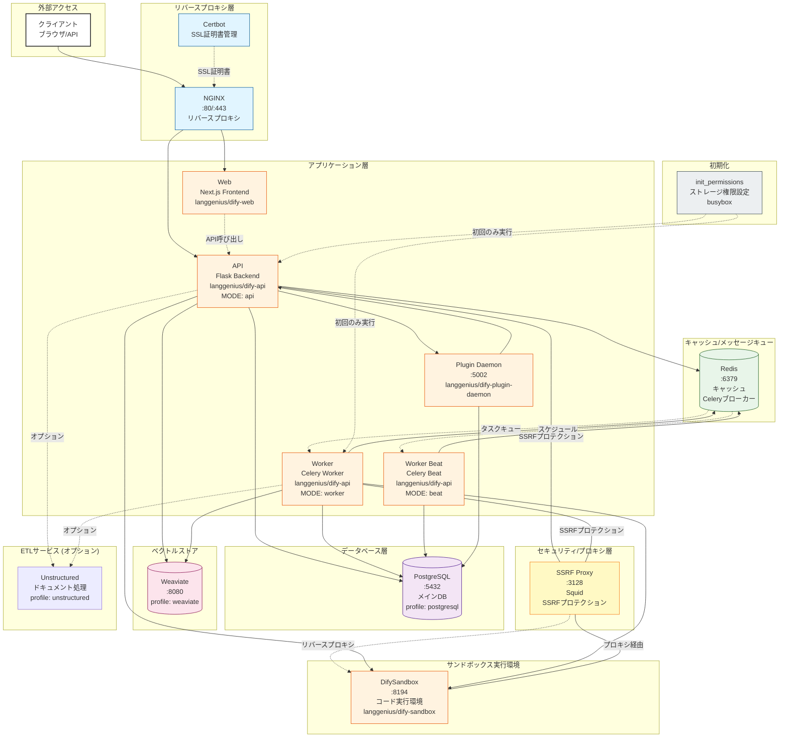

# Dify アーキテクチャ図



## 主要コンポーネント

### 1. **リバースプロキシ層**
- **NGINX**: すべての外部リクエストを受け付け、WebフロントエンドとAPIバックエンドにルーティング
- **Certbot**: SSL/TLS証明書の自動取得と更新（オプション）

### 2. **アプリケーション層**
- **Web (Next.js)**: ユーザーインターフェース
- **API (Flask)**: RESTful APIサーバー
- **Worker (Celery)**: バックグラウンドタスク処理（データセット、ワークフロー、メールなど）
- **Worker Beat (Celery Beat)**: 定期タスクのスケジューラー
- **Plugin Daemon**: プラグイン管理とリモートインストール

### 3. **サンドボックス実行環境**
- **DifySandbox**: 安全なコード実行環境、SSRF Proxyを経由して外部アクセスを制限

### 4. **データベース層**
- **PostgreSQL** (profile: postgresql): 主データベース

### 5. **キャッシュ/メッセージキュー**
- **Redis**: セッションキャッシュおよびCeleryのメッセージブローカー

### 6. **ベクトルストア**
- **Weaviate**: ベクトル検索エンジン（埋め込みベクトルの保存と検索）

### 7. **セキュリティ層**
- **SSRF Proxy (Squid)**: Server-Side Request Forgery攻撃を防ぐためのプロキシ
  - サンドボックスとの専用ネットワーク（ssrf_proxy_network）で隔離
  - 外部ネットワークへの直接アクセスを制限

### 8. **初期化/ユーティリティ**
- **init_permissions**: ストレージディレクトリの権限設定（初回のみ）
- **Unstructured** (オプション): ドキュメントETL処理

## ネットワーク構成

### デフォルトネットワーク
ほとんどのサービスがこのネットワークに接続

### ssrf_proxy_network (内部専用)
- Sandbox、API、Worker、SSRF Proxyが接続
- 外部へのアクセスが制限された隔離ネットワーク
- セキュリティ保護のための重要な分離層

## データフロー

1. **ユーザーリクエスト**: Client → NGINX → Web/API
2. **API処理**: API → PostgreSQL + Redis + Weaviate
3. **非同期タスク**: API → Redis → Worker → DB/ストレージ
4. **定期タスク**: Worker Beat → Redis → Worker
5. **コード実行**: API/Worker → Sandbox (SSRF Proxy経由)
6. **プラグイン管理**: API ↔ Plugin Daemon ↔ PostgreSQL

## プロファイルによる起動

Docker Composeの`profiles`機能により、必要なサービスのみを起動:

```bash
# PostgreSQL + Weaviate構成
docker compose --profile postgresql --profile weaviate up
```

## ポート公開

- **80**: NGINX HTTP
- **443**: NGINX HTTPS
- **5002**: Plugin Daemon
- **5003**: Plugin Debugging
- **各種DB**: プロファイルに応じてポート公開

## ストレージボリューム

- `./volumes/app/storage`: アプリケーションファイル保存
- `./volumes/db/data`: PostgreSQLデータ
- `./volumes/redis/data`: Redisデータ
- `./volumes/weaviate`: Weaviateベクトルデータ
- `./volumes/plugin_daemon`: プラグインストレージ
- `./volumes/sandbox`: サンドボックス依存関係
